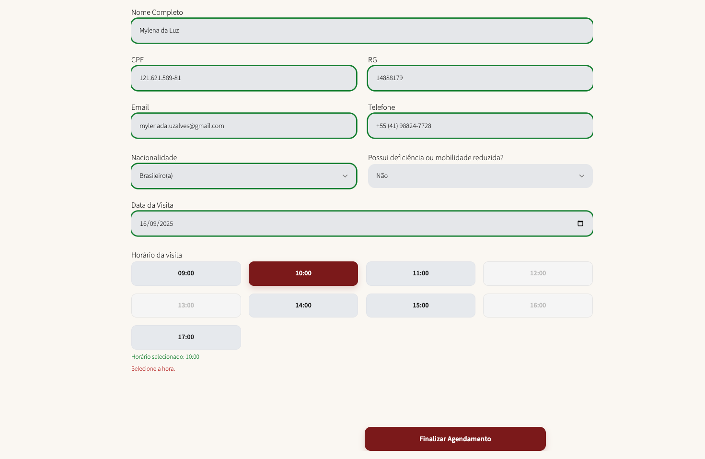
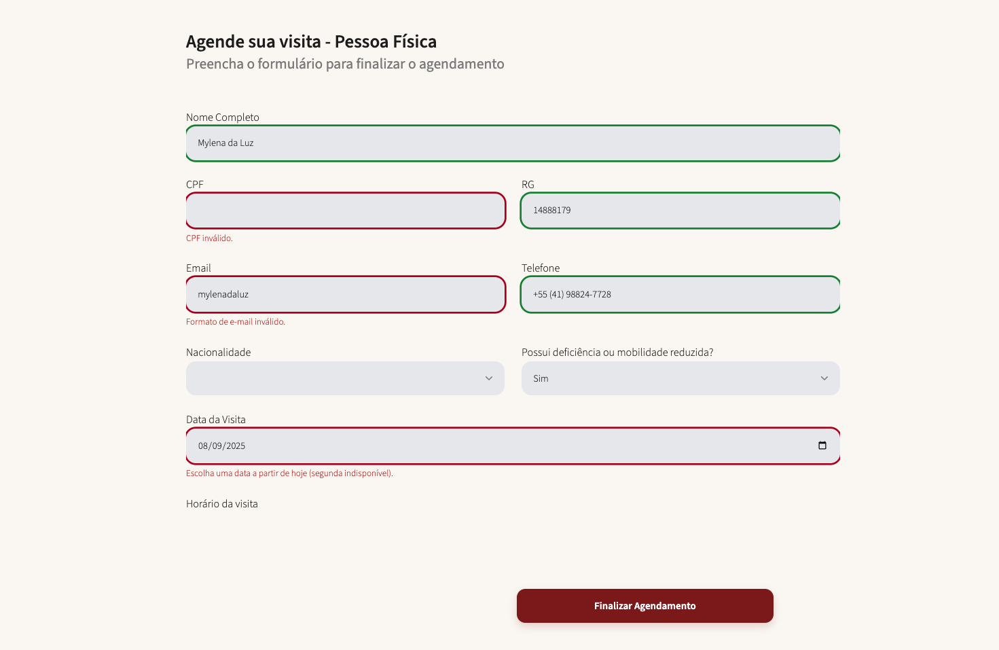
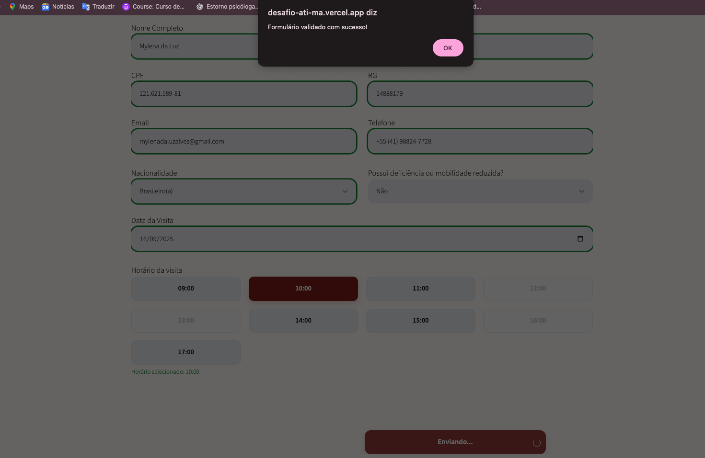
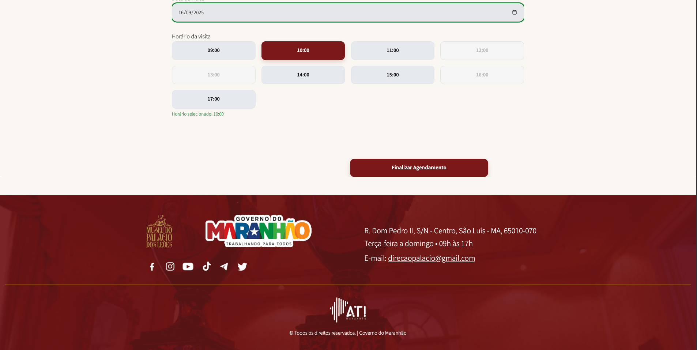
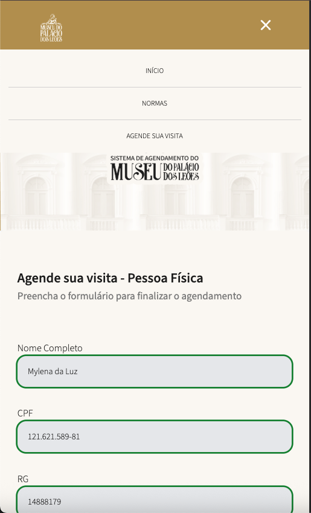
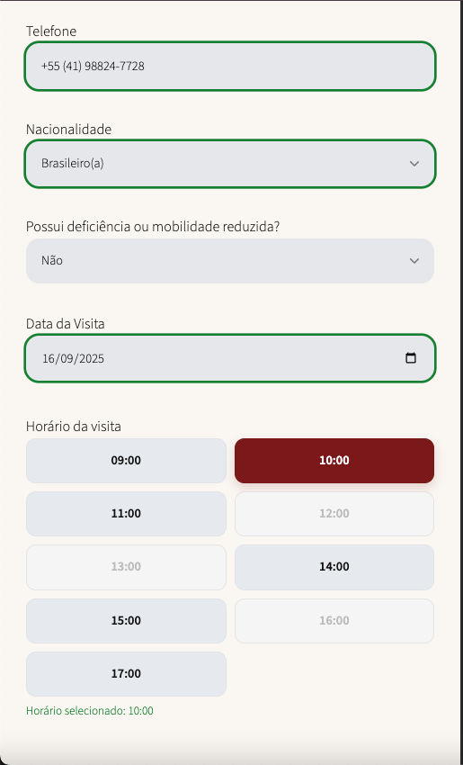

Sistema de Agendamento – Museu do Palácio dos Leões

Formulário de agendamento de visitas com validações, máscaras, acessibilidade e seleção de horários.

📦 Como rodar localmente
	1.	Clone o repositório:

git clone https://github.com/<MylenaLuz>/<desafio-ati-ma>.git
cd <desafio-ati-ma>

	2.	Abra o arquivo index.html no navegador (duplo clique já funciona).

⸻

🧩 O que foi implementado
	•	Validações por campo (inline) com JustValidate:
	•	Nome (mín. 3 caracteres, apenas letras/acentos/hífen/apóstrofo)
	•	E-mail (formato válido)
	•	Telefone (tamanho mínimo/máscara)
	•	CPF (válido quando nacionalidade = Brasileiro(a))
	•	RG (obrigatório quando nacionalidade = Brasileiro(a))
	•	Nacionalidade (select)
	•	Data (não permite datas passadas e bloqueia segundas-feiras)
	•	Hora (exigida e dentro da janela 09:00–17:00)
	•	Máscaras de CPF e telefone com Inputmask (aplicadas ao digitar).

	•	Regras de negócio:
	•	Se Estrangeiro(a) ⇒ CPF e RG deixam de ser obrigatórios.
	•	Seleção de horário:
	•	Grade dinâmica de horários (mock local em array).
	•	Botões desabilitados para horários indisponíveis.
	•	Clique marca o horário e preenche um <input type="hidden"> para o submit.
    
	•	Acessibilidade:
	•	aria-* nos feedbacks.
	•	Foco visível nos campos.
	•	Navegação por teclado na grade de horários.
	•	UI/UX:
	•	Estados de erro/sucesso nos campos (.is-invalid/.is-valid).
	•	Mensagens de ajuda (.hint, .hint.err, .hint.ok).
	•	Botão com estado de “enviando…”.

⸻

🗂️ Estrutura

.
├── index.html
├── assets/
│   ├── style.css
│   ├── images/
│   │   ├── (logos, ícones, bg do hero e do footer)
│   └── js/
│       ├── utils.js        # máscaras, helpers (todayStr, isMonday, etc.)
│       ├── validator.js    # regras JustValidate e submissão simulada
│       └── script.js       # menu mobile, regras de CPF/RG, grade de horários

⸻

🖼️ Screenshots

Coloque aqui prints das principais telas/estados:

	## Tela inicial

	## agendamento

	## formulario

	## enviando

	## footer

	## menumobile

    ## menu mobile open

    ## menu mobile close

⸻

🔧 Tecnologias
	•	HTML5 + CSS3 + JS
	•	Inputmask – máscaras de CPF e telefone
	•	JustValidate – validações de formulário
	•	(Mock local) Array de horários no script.js

⸻

🚦 Observações
	•	O projeto roda 100% estático.
	•	Se futuramente trocar o mock por uma API real, use um servidor local (ex.: npx serve .) para evitar problemas de CORS ao usar fetch.

⸻

✍️ Autor(a)

Mylena Alves 

⸻
